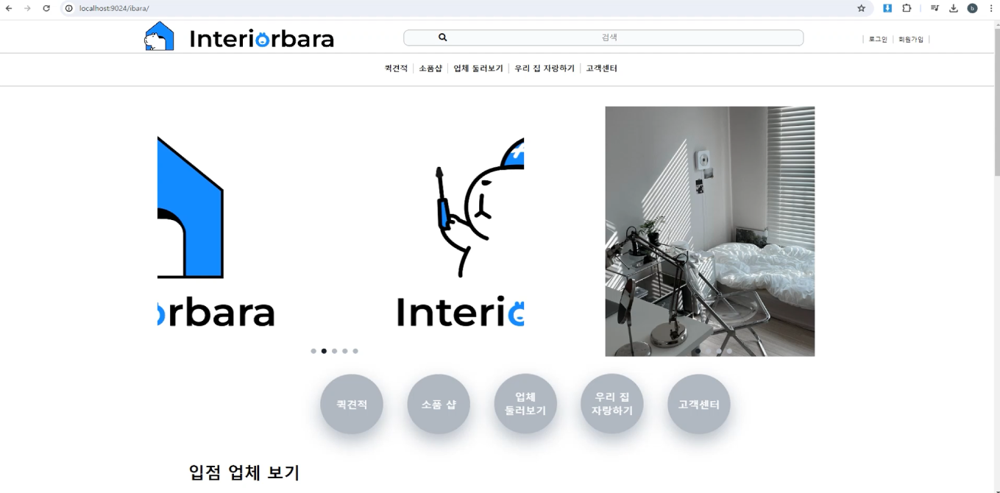
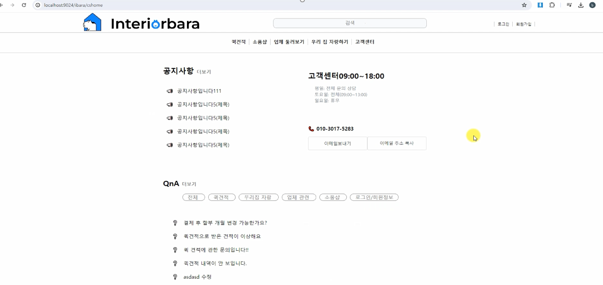
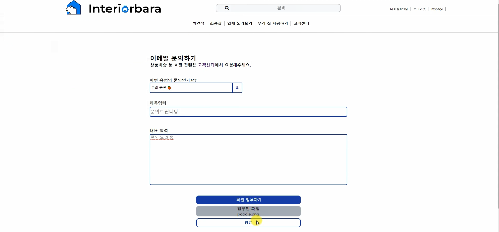

<h2>[2024] 인테리어바라 📰</h2>
번거로운 전화, 연락 없이 빠른 견적내기 및 업체 컨택이 가능한 사이트 입니다!!  

 
 

 
 

## 개요
- 프로젝트 이름: Interiorbara
- 프로젝트 지속기간: 2024.04-2024.05
- 개발 엔진 및 언어: Spring & Java
- 멤버: 팀장 : 조보근 팀원 : 강지수, 강선경, 김경태, 김성민, 장동길
 

## 기술 스택

### frame work

### language & Tools
       

### server 

### DBMS

 

## 담당 기능
### 고객센터 파트 담당 ( 문의 게시판, 이메일문의 기능 )
|||
|:---:|:---:|
|고객센터화면|이메일문의|
||
|고객센터 게시판|
